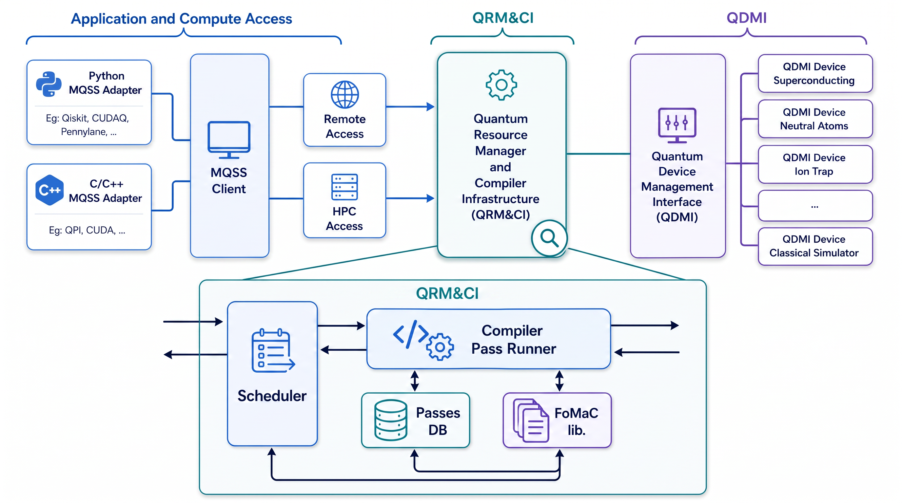

  <picture>
    <source media="(prefers-color-scheme: dark)" srcset="./docs/_static/mqss_logo_dark.svg" width="20%">
    
  </picture>

# Quantum Resource Manager and Compiler Infrastructure (QRM&CI)

<!-- [DOXYGEN MAIN] -->

Quantum Resource Manager and Compiler Infrastructure (QRM&CI), a core
component of the Munich Quantum Software Stack (MQSS) connects classical high-performance
computing (HPC) systems with quantum resources and provides the runtime machinery needed to move
work efficiently between both environments. QRM&CI combines compilation, optimization, scheduling, and device submission in a single workflow.
It applies both target-agnostic and target-specific optimization passes, schedules quantum tasks
across available devices, and returns results from executed circuits back to the originating HPC
application. The result is a unified execution path for hybrid HPC and quantum workloads: tasks are prepared,
routed, executed on real quantum devices, and reintegrated into the broader application flow with as
little friction as possible.

<!-- [DOXYGEN MAIN] -->

    

## Components of QRM&CI

1. **QOffload** hands work into the QRM&CI side from MQSS frontend interfaces.
2. **Platform Selector** chooses the backend on which a quantum task should run.
3. **Compiler** applies target-agnostic and target-specific passes, including optimization and transpilation.
4. **Scheduler** orders ready work according to the configured scheduling policy before submission.
5. **Submitter** sends the job to the chosen quantum device through the **Quantum Device Management
   Interface (QDMI)** and returns the result.

Selector, compiler, scheduler, and submitter behavior are implemented in this repository's code and
entrypoints. QOffload is shown here only to make the boundary visible.

## Getting Started

| I want to...                 | You are here if...                                              | Start here                                     |
| ---------------------------- | --------------------------------------------------------------- | ---------------------------------------------- |
| Deploy QRM&CI                | you want the shipped standalone or distributed daemons          | [Getting Started](docs/getting-started.md)     |
| Build custom QRM&CI workflow | you need a different workflow, compiler, or scheduling strategy | [Using the Library](docs/using-the-library.md) |
| Contribute to QRM&CI itself  | you are editing code in this repository                         | [Development Guide](docs/development-guide.md) |

## License

QRM&CI is released under the Apache License v2.0 with LLVM Exceptions. See
[LICENSE](https://github.com/Munich-Quantum-Software-Stack/QRM/blob/develop/LICENSE) for the full
terms. Unless stated otherwise, contributions to this project are assumed to be licensed under the
same terms.

<!-- [DOXYGEN FAQ] -->

## Contact

Please use the public GitHub channels whenever possible:
[issues](https://github.com/Munich-Quantum-Software-Stack/QRM/issues),
[discussions](https://github.com/Munich-Quantum-Software-Stack/QRM/discussions), and
[pull requests](https://github.com/Munich-Quantum-Software-Stack/QRM/pulls). This keeps questions,
proposals, and implementation details visible and easy to follow.
