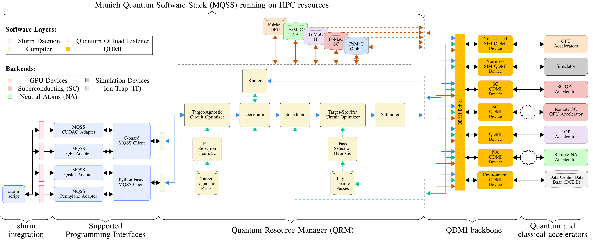
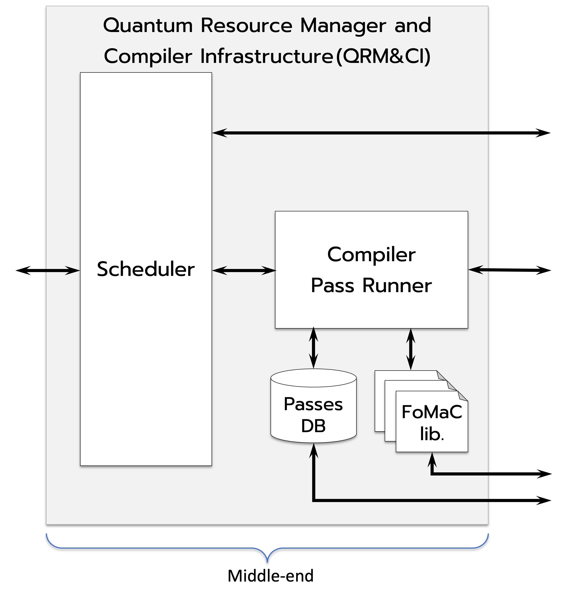

<!----------------------------------------------------------------------------
Copyright 2024 Munich Quantum Software Stack Project

Licensed under the Apache License, Version 2.0 with LLVM Exceptions (the
"License"); you may not use this file except in compliance with the License.
You may obtain a copy of the License at

TODO

Unless required by applicable law or agreed to in writing, software
distributed under the License is distributed on an "AS IS" BASIS, WITHOUT
WARRANTIES OR CONDITIONS OF ANY KIND, either express or implied. See the
License for the specific language governing permissions and limitations under
the License.

SPDX-License-Identifier: Apache-2.0 WITH LLVM-exception
---------------------------------------------------------------------------->

  <picture>
    <source media="(prefers-color-scheme: dark)" srcset="./docs/_static/mqss_logo_dark.svg" width="20%">
    
  </picture>

# Quantum Resource Manager (QRM) of the MQSS

<!-- [DOXYGEN MAIN] -->
This repository hosts the Quantum Resource Manager (QRM), a component of the Munich Quantum Software
Stack (MQSS) that bridges classical and quantum resources within a high-performance and quantum
computing (HPCQC) environment. The QRM acts as a robust runtime framework, seamlessly orchestrating
operations between HPC and quantum resources.

At its core, the QRM is capable of performing optimizations, both agnostic and tailored to specific
target devices, while efficiently scheduling quantum tasks across the diverse landscape of available
quantum resources at LRZ. This ensures that resources are utilized to their fullest potential,
maximizing performance in a tightly integrated HPCQC setting.

One of the QRM's remarkable capabilities is its ability to perform circuit cutting—an intelligent
method for breaking down large, complex quantum circuits into a set of more manageable sub-circuits.
This technique is particularly advantageous when the scale of the application surpasses the number of
qubits available. The resulting smaller sub-circuits can be allocated to quantum devices with limited
physical qubits, allowing for effective execution without sacrificing the integrity of the computations.

Moreover, the QRM plays a critical role in collecting and transmitting the outcomes from these quantum
circuits, which are executed on real quantum devices, back to the original HPCQC application. This
streamlined feedback loop ensures that results from quantum computations are seamlessly reintegrated
into the broader computational ecosystem.

<!-- [DOXYGEN MAIN] -->

  
  </a>

## FAQ

<!-- [DOXYGEN FAQ] -->

### What is MQSS?

**MQSS** stands for _Munich Quantum Software Stack_, which is a project of the _Munich Quantum
Valley (MQV)_ initiative and is jointly developed by the _Leibniz Supercomputing Centre (LRZ)_ and
the Chairs for _Design Automation (CDA)_, and for _Computer Architecture and Parallel Systems
(CAPS)_ at TUM. It provides a comprehensive compilation and runtime infrastructure for on-premise
and remote quantum devices, support for modern compilation and optimization techniques, and enables
both current and future high-level abstractions for quantum programming. This stack is designed to
be capable of deployment in a variety of scenarios via flexible configuration options, including
stand-alone scenarios for individual systems, cloud access to a variety of devices as well as tight
integration into HPC environments supporting quantum acceleration. Within the MQV, a concrete
instance of the MQSS is deployed at the LRZ for the MQV, serving as a single access point to all of
its quantum devices via multiple compatible access paths, including a web portal, command line
access via web credentials as well as the option for hybrid access with tight integration with LRZ's
HPC systems. It facilitates the connection between end-users and quantum computing platforms by its
integration within HPC infrastructures, such as those found at the LRZ.

    

### What is the **Quantum Resource Manager (QRM)**?

The QRM is designed to run on HPC resources and is composed of the following blocks:

    

1. **Target-agnostic pass runner**: module that receives quantum tasks (circuits) and performs
   target-specific optimizations on each received quantum task.
2. **Generator** (optional): module that receives quantum tasks and performs **circuit-cutting**
   techniques to partition large, highly entangled quantum circuits into a set of smaller
   sub-circuits.
3. **Scheduler**: module that receives quantum tasks and schedules each quantum task, i.e.,
   selecting a device where each quantum task will be executed.
4. **Target-specific pass runner**: module that receives quantum tasks after scheduling. Thus,
   **transpilation** and target-specific passes can be applied to each received quantum task for
   further optimizations.
5. **Submitter**: module that receives quantum tasks and submits them to the selected quantum device
   via the **Quantum Device Management Interface (QDMI)**.
6. **Knitter** (optional): module that receives all the sub-circuits generated by the generator
   module from a large, highly entangled quantum circuit. Here, the results of smaller sub-circuits
   are combined via knitting techniques to get the results of the large, highly entangled quantum
   circuit previously partitioned by the generator.

### Where is the code?

The code is publicly available and hosted on GitHub: TODO

### Under which license is the **Quantum Resource Manager (QRM)** released?

The Quantum Resource Manager (QRM) is released under the Apache License v2.0 with LLVM Exceptions.
See [LICENSE](TODO) for more information. Any contribution to the project is assumed to be under the
same license.

<!-- [DOXYGEN FAQ] -->
